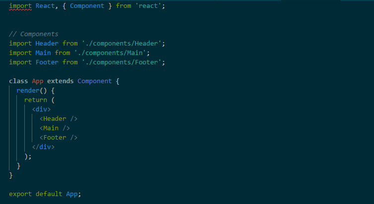
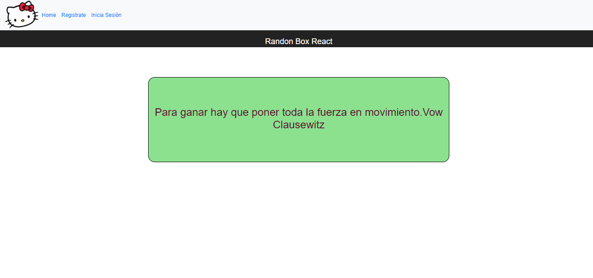

# Randon Box

## Descripción

Crear un randon que cambie de color y tamaño de letra al refrescar la página.

## Componentes
La composiciópn la tenemos en App, son cuatro componentes header, main, aside y footer con sus respectivos estilos.

##  Recursos utilizados

* HTML5
* CSS
* JQUERY
* Eslintrc 
* Bootstrap
* React

## Producto

## Autor

* Jymma Mogollon

## Licencia

*Copyright (C) 2018 ~ *
